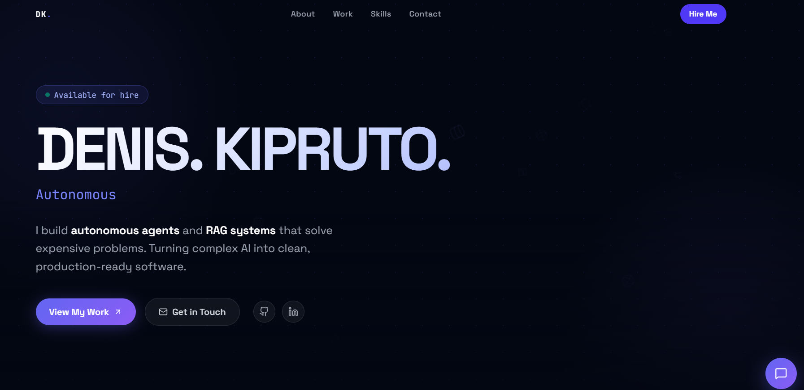

# Denis Kipruto | Full Stack Engineer & AI Specialist

A modern, interactive portfolio website built with Next.js 14, featuring AI-powered chat functionality, smooth animations, and a responsive design showcasing AI engineering expertise and full-stack development projects.



## 🚀 Features

- **Interactive Hero Section** - Animated spotlight effects and falling tech icons
- **AI Chat Assistant** - OpenAI-powered chatbot to answer questions about skills and projects
- **Project Showcase** - Animated project cards with hover effects and live/demo links
- **Responsive Design** - Optimized for all screen sizes
- **Performance Optimized** - Built with Next.js 14 App Router and modern best practices
- **TypeScript** - Full type safety across the codebase

## 🛠️ Tech Stack

- **Framework:** Next.js 14 (App Router)
- **Language:** TypeScript
- **Styling:** CSS Modules + Custom CSS Variables
- **Animations:** Framer Motion
- **Icons:** Lucide React
- **AI:** OpenAI API (GPT-3.5 Turbo)
- **Fonts:** Space Grotesk (via next/font)

## 📁 Project Structure

```
my-portfolio/
├── app/
│   ├── api/
│   │   └── chat/
│   │       └── route.ts        # AI Chat API endpoint
│   ├── components/
│   │   ├── ChatWidget.tsx      # AI Chat widget
│   │   ├── Navbar.tsx          # Navigation bar
│   │   ├── ProjectCard.tsx     # Project showcase card
│   │   ├── Spotlight.tsx       # Mouse follower effect
│   │   ├── TechBackground.tsx # Animated tech icons
│   │   └── TypewriterText.tsx  # Typewriter animation
│   ├── globals.css             # Global styles with CSS variables
│   ├── layout.tsx              # Root layout
│   └── page.tsx                # Home page
├── public/                     # Static assets (images, icons)
├── .env.local                  # Environment variables
├── next.config.ts              # Next.js configuration
├── postcss.config.mjs          # PostCSS configuration
└── tsconfig.json               # TypeScript configuration
```

## 🚀 Getting Started

### Prerequisites

- Node.js 18.17 or later
- npm, yarn, pnpm, or bun
- OpenAI API key (for AI chat functionality)

### Installation

1. Clone the repository:
   ```bash
   git clone git@github.com:Kip-opp/my-portfolio.git
   cd my-portfolio
   ```

2. Install dependencies:
   ```bash
   npm install
   ```

3. Set up environment variables:
   ```bash
   cp .env.example .env.local
   ```
   Add your OpenAI API key to `.env.local`:
   ```env
   OPENAI_API_KEY=sk-your-api-key-here
   ```

4. Run the development server:
   ```bash
   npm run dev
   ```

5. Open [http://localhost:3000](http://localhost:3000) in your browser.

## 🔧 Configuration

### Environment Variables

| Variable | Description | Required |
|----------|-------------|----------|
| `OPENAI_API_KEY` | OpenAI API key for AI chat | Yes |

### Customization

- **Projects:** Edit [`app/page.tsx`](app/page.tsx) to update project cards
- **Skills:** Update the `skills` array in [`app/page.tsx`](app/page.tsx)
- **AI Persona:** Modify the system prompt in [`app/api/chat/route.ts`](app/api/chat/route.ts)
- **Styling:** Customize CSS variables in [`app/globals.css`](app/globals.css)

## 💼 Services

- **AI & RAG Systems** - Enterprise-grade retrieval-augmented generation pipelines with zero hallucinations
- **Full Stack Development** - End-to-end web applications with Next.js, TypeScript, and scalable backends
- **Autonomous Agents** - LLM-powered agents that automate complex workflows and replace manual processes

## 📂 Projects

- **Omnibrain** - Enterprise-grade RAG system that indexes complex PDFs into vector databases. Built with Next.js, Pinecone, and OpenAI.
- **Career OS** - SaaS-ready career acceleration tool that uses LLMs to analyze job descriptions and rewrite resumes with custom PDF generation.
- **Lead Scraper** - Autonomous prospecting engine that scrapes high-value leads from target websites and structures data for sales teams.

## 🚀 Deployment

### Vercel (Recommended)

1. Push your code to GitHub
2. Connect your repo to [Vercel](https://vercel.com)
3. Add `OPENAI_API_KEY` in Vercel environment variables
4. Deploy!

### Other Platforms

```bash
npm run build
npm start
```

## 📄 License

MIT License - feel free to use this template for your own portfolio.

## 🤝 Connect

- **GitHub:** [github.com/Kip-opp](https://github.com/Kip-opp)
- **Email:** denis.dev.ke@gmail.com

---

Built with ❤️ using Next.js, Framer Motion, and OpenAI
